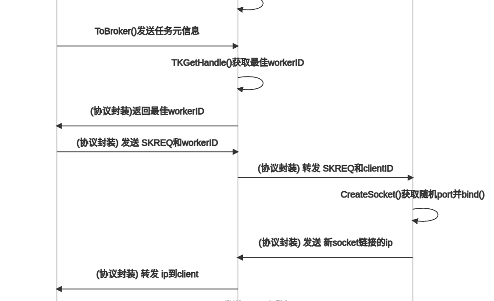

## 第一阶段：场景应用

### 切片

- 根据深度模型的特点，挑选可切片的模型
- 模型针对不同类型资源的占用比例不同，挑选何种DL library
- 是否需要云的参与
- 云边端纵向协作还是横向协作（各自的职能是什么）（）

### 卸载

- 根据不同的设备资源状况，进行部分卸载或者全部卸载
- 卸载模型如何进行通信
- 设备是根据自身类型接收不同的模型来完成不同的业务，还是会只处理当前某一种业务（业务是否交替更新）-----针对场景考虑

### 优化

- Edge device 和end device的职能是什么
- 是否可以多进程，单个节点同时处理多个小任务（会影响切片方式以及资源、任务隔离）
- 在何处对模型进行优化

### 方案

- 设备可执行多种DL模型，根据一个时间序列内收到的任务类型，向server请求相应的DL模块来进行推断

* * *

## 真实场景初步部署

### Deep Stack

- 1.  功能：运行内嵌的深度模型，运行用户自定义的深度模型
- 2.  部署方式：docker
- 3.  选择原因： Deep Stack本身的功能并不多，内嵌的深度模型也只包含面部识别、匹配等基础功能。本身的功能就是模型训练和推断，抛开他单纯自己写python来训练、推断也是可以实现的。Deep Stack的优势是可以跨平台，帮我们解决了不同硬件以及操作系统下的适配。
- 4.  适用平台：DeepStack is available on all Arm64 devices including Raspberry PI, Qualcomm DragonBoard 410c, AWS Graviton Servers and any device with a Arm64 processor and a Linux 64 Bit OS（[https://docs.deepstack.cc/arm64/index.html）](https://docs.deepstack.cc/arm64/index.html%EF%BC%89)

### 切片、部署

负责：网络通信、主机-docker通信、切片识别（DAG）、Deep stack模型部署、Deep stack 结果导出

1.  任务初始化阶段主机从网络中接收切片，任务执行阶段主机从网络中接收切片的执行参数。
2.  接收到执行参数（当前切片的输入）后对参数进行识别，以确定其是否对应当前主机docker内的切片。

> 例如：可以通过 模型id-切片起始位置-切片终止位置 进行记录，每当主机结束当前推断后，在结果上加入本切片的信息。若切片的终止位置 == 模型终止位置则任务结束，结果返回，否则继续传递。当主机接收到参数输入时要进行检查，判断该输入是否为本机本机切片的上一个临近切片的结果。若匹配则部署到Deep stack，否则丢弃或缓存。

3.  将参数通过主机-docker通信部署到Deep stack内，运行本机的切片
    https://docs.deepstack.cc/custom-models/index.html
4.  Deep stcak结果导出，发往下一主机节点

*若考虑到不同操作系统的移植性问题，可将第二步的切片有向图识别放在doker内部进行。即收到参数就传入docker内，在docker内进行判断*

*第二步有些困难，不过逻辑类似TCP的可靠数据传输原理*

### 资源监控

感觉docker stats 然后把结果写入文件就足够了。
https://www.cnblogs.com/duanxz/p/10238079.html
但是要设计好不同的资源表和采集时间点。采集好的信息如何进行保存？

# 树莓派助教

## 工作流程

## 部署文档

1.更换源时报错：没有公钥

解决方案：
https://www.tkdcz.top/post/93.html

## tensorflow版本不一致，代码修改

1.  prediction.py
    tf.app.flags -> tf.compat.v1.flags
    
2.  flask_server.py
    11:sess = tf.compat.v1.Session()
    

3.prediction.py
23:有output_model
所以需要在项目根地址新建output_model文件夹

# ZeroMQ

## Question

1.  Now, imagine we start the client before we start the server. In traditional networking,
    we’d get a big red Fail flag. But ØMQ lets us start and stop pieces arbitrarily. As soon as the client node does zmq\_connect(), the connection exists and that node can start to write messages to the socket. At some stage (hopefully before messages queue up so much that they start to get discarded, or the client blocks), the server comes alive, does a zmq\_bind(), and ØMQ starts to deliver messages. -- 《ZeroMQ》p33

server 和 client之间有一个消息队列作为缓冲。假设client先上线，server还未上线。那么client会先将信息存储到消息队列内。若队列满了那么可能会阻塞client端或者丢弃已有的packet

2.  A server node can bind to many endpoints (that is, a combination of protocol and
    address), and it can do this using a single socket. This means it will accept connections
    across different transports:

一个server的socket可以绑定多个端口，端口数量有上限吗。如和 区分不同端口接受到的信息。-- 《ZeroMQ》p33

3.  It uses lock-free techniques for talking between nodes, so there are never locks,
    waits, semaphores, or deadlocks.

不用锁？怎么实现同步？

**7-28 开发阶段**

1.  可以参考0MQ p42、43的代码实现接收感知信息的同时接收计算任务。
2.  通过前缀来区分计算任务和感知任务

感知框架设计：
https://juejin.cn/post/6844903937653342216

Metric Table就是服务注册表
Client就是服务提供者
Server就是服务调用者
架构如图所示：

分布式场景下：服务注册者按照心跳机制进行持续的服务注册。请求者通过向Server提出请求。Server查询表，若有执行，server同时维护表。

上图为总框架：包含感知+服务

## 任务注册（synchronous.h）

**服务同步** ：当server接收到client的请求时表明二者已经完成感知环节了。服务请求过程client需要发送初始数据和模型文件。所以发送初始数据的过程就是同步过程，这里的阻塞要设置时间。当阻塞过长时间就取消发送并修改metric表。
并且在发送.h5模型的时候要进行一步模型转换。在用户看来我发送的是Keras模型，但是实际实现的时候，网络上传输的tenserlite模型。
规定要发送的模型以及初始数据都存放在redis里。保存字典键。键是任务id，值保存（数据id：数据路径，模型id：模型路径）。后面加比分的话采用有序集合键。
同步：发送任务id，收到确认后。发送数据。发送模型。

**问题**：

1.  目前通过文件大小来控制发送接收的可靠性。这部分看ZeroMQ里可靠性那一章。
2.  任务在client和server的表达方式不同。**client**要先生成唯一的任务id，将任务保存在model文件夹下。再通过有序列表的方式将任务id，任务紧急程度保存在client的数据库中。**server**接收到后将文件的id，任务的各项需求计算出来。保存在集合中

**方案--client**：给用户暴露的接口越简单越好。用户看来就直接给出两个文件的路径。然后client生成一个唯一的任务id。在model下根据任务id创建新的任务文件夹，并将文件拷贝至该文件夹下。然后在redis中保存taskId键。
**方案--server**：却一个计算各项需求的方法。其他暂时没有要加的。

**补充**

1.  client进行任务的优先级计算，然后根据自己的metric table信息发送给相应的server。server就不需要再计算优先级了，按照先来先服务的方式接受调度。
2.  任务注册里的client是感知注册中的broker。任务注册里的server是感知注册里的server。任务注册里的CliGetFile是感知注册里的client。

## 感知同步（dixcovery.h）

感知主要采用被动感知策略。即所有节点接收其他节点的感知信息并进行信息储存，并不进行信息回复。
采用心跳机制，参考p162

如何实现广播？pub sub不太适合，因为在建立sub的时候需要知道pub方的地址。这部分越过了第一次的感知。
此处默认第一次感知完成。节点间有一个明确的对应关系。

**方案--client** : 作为系统暴露给用户的接口，负责接收用户的任务请求。并将任务请求发送至Broker。Broker中保存着worker的所有信息，也就是broker中保存着Metric Table。同时为了降低Broker的负担，client负责计算任务的优先级。
**Broker** ： **包含三条信息流**

1.  接收client的任务请求及相应的任务优先级。查找对应的Metric Table挑选最合适的worker，将信息发往worker。并接收worker的返回值，将结果返回给client
2.  接收worker的心跳感知包，将感知信息保存至Metric Table中。
3.  自身产生心跳感知包，使得client和worker能够个感知自身的存在。（这个不急着做）
    **方案--worker** ：
4.  接收任务，执行任务，返回任务。
5.  感知Broker是否存在，若不存在则及时释放资源（不着急做）

**问题**

1.  worker与broker方向需要进行协议封装，worker发送的信息要包含自身的地址，算力资源。 同样broker需要根据worker的地址信息进行任务的分发---参考p167 p178注释
2.  那么应该怎样生成这个随机值呢？我们使用的是从/dev/urandom读取的20个字节，但你也可以找个更简单的方法，只要能满足任务就行。例如，可以使用/dev/urandom初始化RC4算法，然后用其产生随机数流。更简单的方法是组合unix时间戳和客户端ID, 这并不安全，但对很多环境而言也够用了。
3.  实现过程中遇到一个场景，可能同时有多个client将信息发送给worker。多线程共用一个socket，worker在接受信息的时候就会发生数据错乱。
    **方案** ： 创建一个新的消息类，为每条通道分配对应UUID的头信息。worker在接收信息的时候根据头信息，将数据保存在不同的文件中。（先看看zmq已有的接口能否实现这个功能）
    文件发送时先发送任务id，然后伴随着节点的uuid。可以保存相应的键值对，worker在接收数据的时候，根据msg的uuid查找到相应的任务id，然后保存在相应的文件下。（bingo！）

再看看router的工作机制

### 步骤一：先实现一个简单的负载均衡

#### 架构 

#### 参考：lbbroker.cpp

#### 代码组织：分为三个cc文件，分别是worker，broker，client

可以分为两个通道，一个是感知通道另一个是任务任务通信通道。两个通道共用一组socket的UUID。所以UUID要保存在redis里面。

client、broker、worker分别运行在三个不同的机器上。

## 步骤

**感知**

1.  worker根据时间间隔发送信息给broker（先简单一点，根据更新时间分配任务）
2.  broker接收信息更新本地redis中的信息

**执行**

1.  首先用户调用synchronous.h中的CliGetFile，倒入任务信息，并维护redis信息。并向LBClient发送信号
2.  LBClient接收信号后，将任务的元信息（带宽+算力）发送给LBbroker。LBbroker接收后根据redis中的worker信息判断到底转发至哪个worker。
3.  broker通知worker，worker调用ServerSyn等待数据
4.  broker将worker的UUID返回给LBClient
5.  LBClient调用ClientSyn向worker发送信息
6.  worker执行完后返回结果，client接收结果将结果保存至redis中。

## 任务执行（考虑用容器）

3.  感知的同步流程参考72、73. 具体的同步可以分为第一次同步（Metric table为空）、多次同步（Metric不为空）

优化：

1.  client在请求时对任务的时延/算力有阈值要求，所以server需要根据阈值要求动态修改分配的算力多少。例如：针对cpu要求为2的我最大分配2.2.cpu要求为5的我最大分配5.3
2.  模型/数据在发送的过程中可以进行一步压缩

## 调试问题记录

1.  https://blog.csdn.net/qq_35227352/article/details/114707692
    
    c++ 类体中不允许对成员变量进行初始化，所以后期需要能够动态扩展线程池的大小。
    
    第二种方式是对的
    
2.  在worker中采用以下代码
    
    
    此时worker采用REQ的模式，该模式是发送一次msg，阻塞等待回复。收到回复，发送下一次，继续阻塞一直循环下去。
    但是在zmq_poll时采用阻塞等待的方法，heart beat可以正常运行。但是没办法收到broker转发的SKREQ请求。因为heart beat是每次主动发送包，接收回复，满足REQ的通信模式。
    但是SKREQ并不会主动向broker发送包，而是从一开始就处于等待包的流程所以这部分会一直阻塞/借用HBREQ的逻辑导致两个流程包错乱！！
    

因此这部分要么再划分为两个socket与broker相连（一个是REQ一个是REP）。要么换成非阻塞的通信协议！

看一看  Asynchronous Majordomo Pattern

3.  又涉及到一个新的问题，因为broker里面各个阶段涉及到了多步的阻塞等待环节，而此时的socket是处于多线程共享的状态。那么会有很大概率的包错乱的情况发生。（时刻注意尽量不要共享socket，如果共享就不要涉及到多段数据的阻塞式发送接收）

此处的代码是broker里针对m\_tkworker的监听代码，此处为了协调client与worker之间创建连接，在121行会监听m\_hbBroker的消息。

但是此时的默认loop里有针对m_hbBroker监听的另一逻辑。所以二者会产生冲突！！

**修改方案** ： 在进行SKREQ处理的过程中存在较多的冗余握手！

可以看到，client首先想broker发送了任务信息，broker找到合适的worker后将信息返回到了client。然后再进行一轮client到worker的握手操作。

那么是否可以只通过一轮的握手就完成client与worker的连接建立呢？
当client发起请求的时候表明此时client有任务在等待状态，此时由client选取自身的空闲port并向broker发送ip信息。
broker对TK线程的分配也应提前一点，因为zeroMQ的socket并不是线程安全的。如果同时有多个client发送请求，broker这边也会包错乱。 所以将88-100行都纳入线程处理逻辑中。（这部分zeroMQ好象是封装好了，100个client线程测试的时候倒没发现问题，这块先不改吧。**看看底层是怎么实现的。。。跟调用SND_MORE有什么区别？？**）

当broker收到client信息后，按照原逻辑挑选合适的worker并将数据转发至worker处。worker进行监听并接收client的数据。（这里面因为是消息队列所以client在bind之后就可以直接向队列里面丢数据了，不用等待同步信息。但是要注意，避免长期阻塞！！）

4.  zeroMQ的identity并不是单纯的字符串。所以在从redis中取出identity并向ROUTER发送时会有问题！需要看一下底层对于identity是怎么封装的！！
    
    93行可以正常转发，94行不行
    
    **bug解除 ！** : 之前不行是因为调用了两次receive逻辑，而client只有一次的send逻辑，所以在cout之前阻塞住了。其实前三个包已经到达了。
    正确的逻辑应该是94行，在其他地方调用的是
    
    注意此处149clientId的长度是9,而我们在lbhelper里面定义的是
    
    id的大小是10,所以会出现broker协调失败！！！这里要注意！！！
    这里的s\_set\_id是按照官方提供的zhelper.h修改的。
    但是**注意** redis保存的时候只保存了9位，因为redis的命令是
    
    最后一位空位会被hiredis的解析器判定为空格给省略掉。现在把identity改成9位。

5. 还是延续上一个问题，发现了新的问题
.

以上分别为三个程序的运行输出，但是可以看到worker最后一次输出了Still Running后就停住了。而worker这部分的代码为

可以看到worker其实是阻塞在了68处，而此时worker就不能发送HBREQ了。所以测试的时候也要注意阻塞问题。

当设置为67行的非阻塞方式时，程序运行结果如图

这时程序就能正常运行了，但是worker处的client ip没协调好。再修改修改！

6. 流程都对，看看是不是syn代码改动了？

问题找到了，client监听的端口并不是代码里指定的10000 而是 34133 。

worker也并没有监听client 给的ip。  动态创建ip的过程有问题。

**调试方法** ： 
ps -a | grep 进程名
sudo netstat - nap | grep pid 就可以得到该进程帮顶/监听的端口号了

netstat -tln | grep 8080 可查看端口是否被占用

**bug半解除！** ： 
244系统正常运行，243就会绑定到其他的端口。看看zmq_bind的源代码！